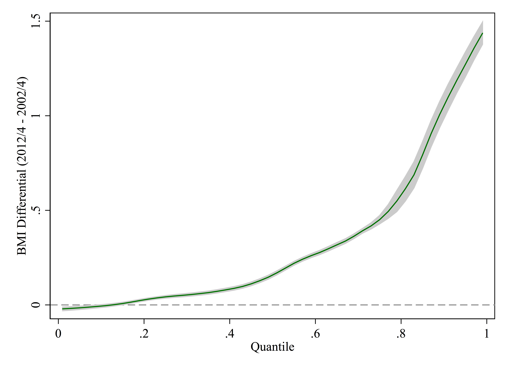

# Explaining the widening distribution of Body Mass Index: A decomposition analysis of trends for England, 2002/04-2012/14
Mark Green1
Francisco Rowe1

1Geographic Data Science Lab, University of Liverpool, UK

**Abstract**

While there is increasing international evidence for the widening of the
distribution of body mass index (BMI), there has been little attempt to
explain this trend. The aim of our study is to examine whether the trend
can be explained by compositional changes within the population or
contextual changes in the relationships between explanatory variables
and BMI. Data from the Health Survey for England for 2002-4 and 2012-
4 were used. BMI was our outcome variable and explanatory variables
included age, sex, ethnicity, education, occupation and physical activity.
We examined how predictors of BMI varied at the 10th, 50th and 90th
percentiles using unconditional quantile regressions. Oaxaca-Blinder type
decomposition analysis was then applied to examine whether contextual
or compositional explanations accounted for changes in the distribution
between time periods. We found that changes in the nature of
relationships observed by our coefficient values accounted for 63% of
the difference in BMI at the 90th percentile in 2012-4 compared to 2002-
4. Ethnicity, physical activity and socio-economic status were the
primary reasons for explaining the continued growth of the right tail of
the BMI distribution, with large effect sizes observed for ethnicity and
physical activity. Compositional changes in the population were less
influential (37%), but may have offset some of the contextual changes
to relationships. Changing relationships between predictors of BMI reflect
systematic changes in the determinants of BMI, leading to the widening
of the BMI distribution. Our results demonstrate the importance of multitiered
policies aimed at tackling the varying influences across the BMI
distribution, and suggest that Geoffrey Rose’s population strategy
approach may be less appropriate for tackling obesity.

**Keywords**: bmi, obesity, england, quantile regression, RIF decomposition

